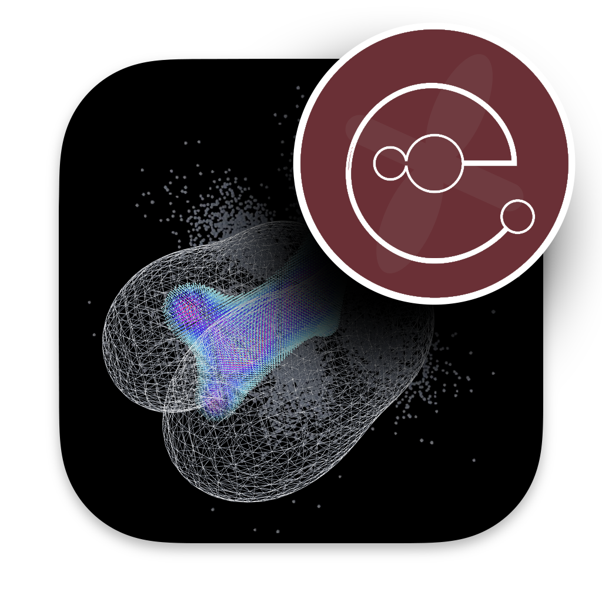
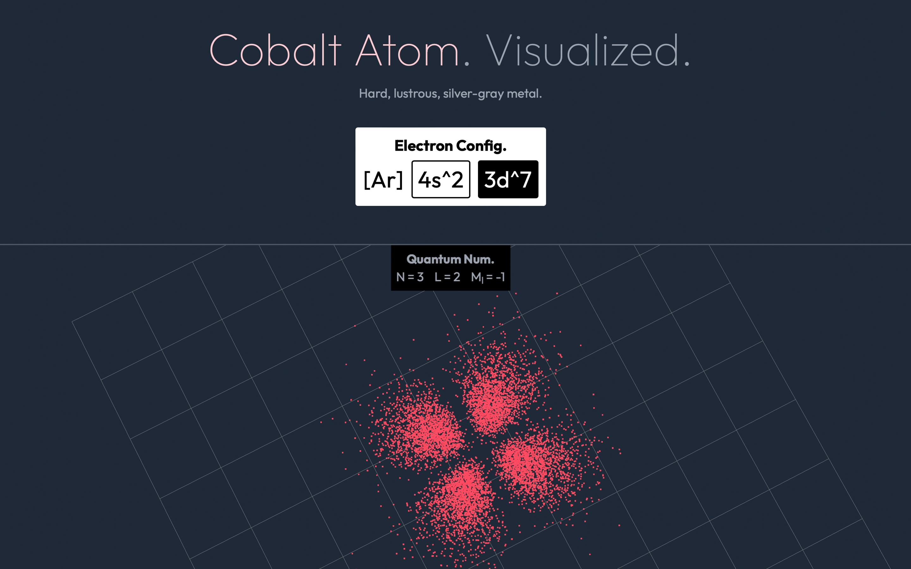
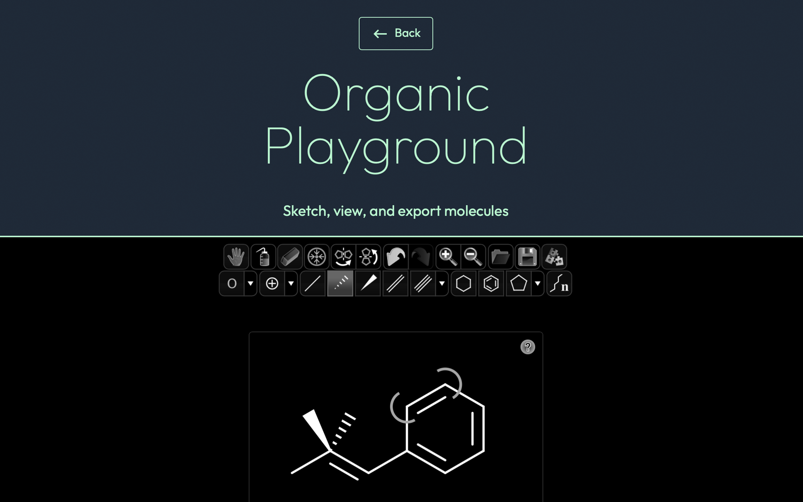
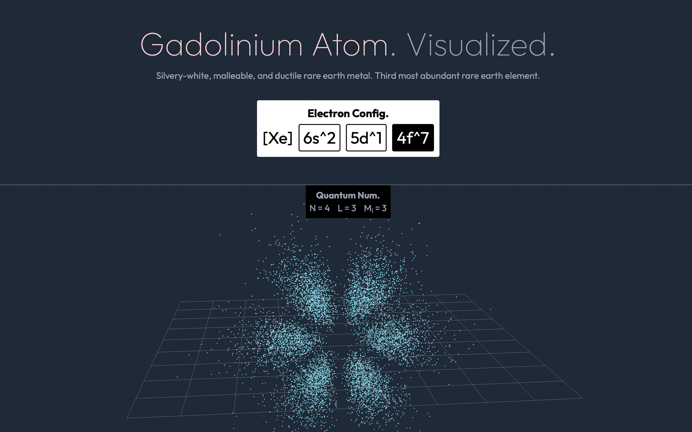

# ElectronVisualized

ElectronVisualized provides an interactive visualization in the areas of chemistry and quantum mechanics. 
The app showcases atomic orbitals through electron density — alongside with molecular orbitals — beautifully and elegantly.

[**https://electronvisual.org**](https://electronvisual.org)

<table><tr>

<td valign="center"></td>

<td valign="center"></td>

</tr></table>

## Stunning Visuals
Both atomic and molecular orbitals are displayed on a three-dimensional plane where you can freely rotate around.

---

## Organic Playground
With our playground feature, you can draw any molecules with dots and lines.
Auto-snapping allows users to do this in an easiest way possible.

---

## Find My Electron
Our robust search feature provides an extraordinary insight into the properties of molecules.
Unapologetically — it is the most efficient way of navigating the PubChem database.

<table><tr>

<td valign="center"></td>

<td valign="center"></td>

</tr></table>

<table><tr>

<td valign="center"></td>

<td valign="center"></td>

</tr></table>
