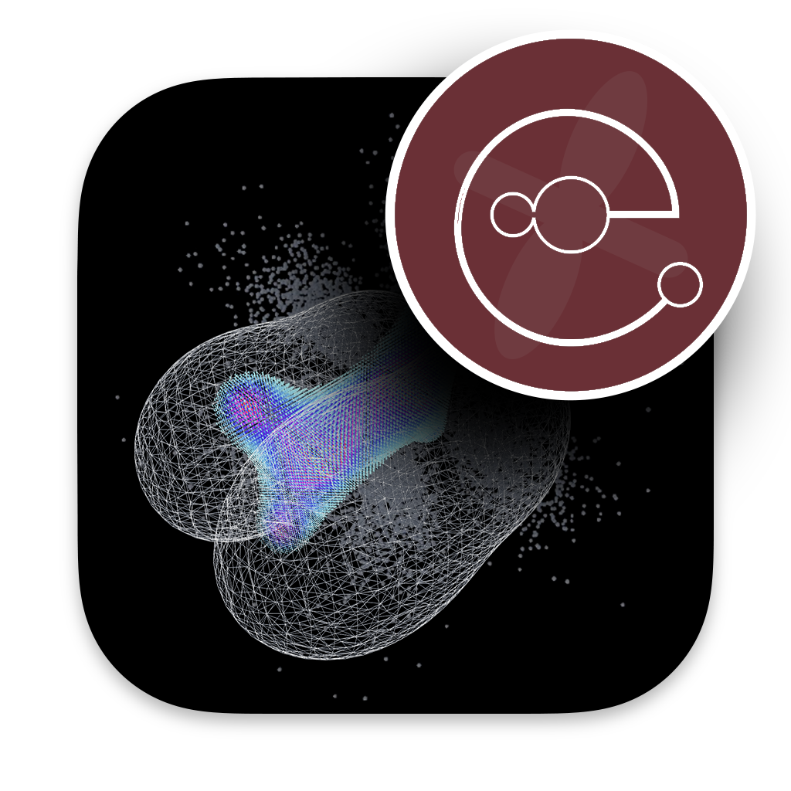
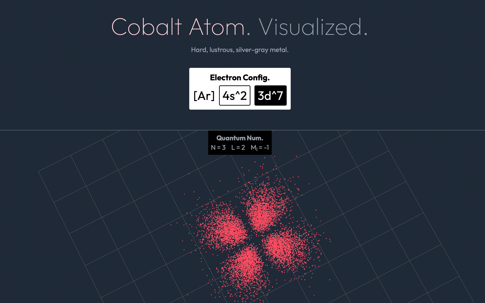
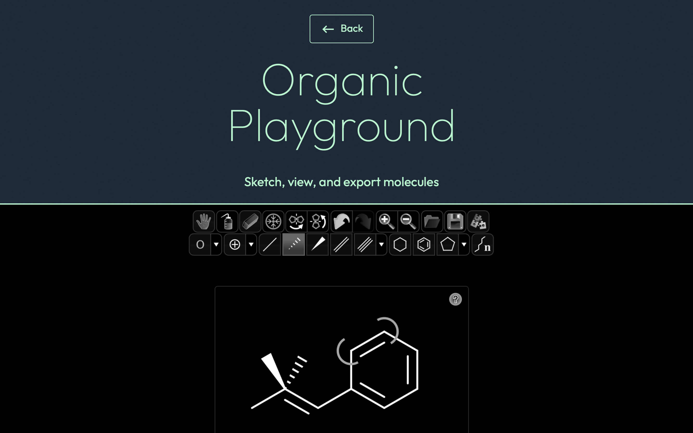
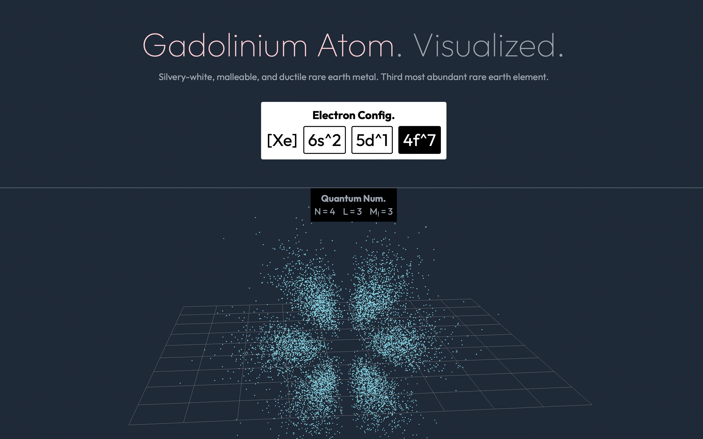

# ElectronVisualized

A cross-platform **quantum mechanics visualizer powered by Density Functional Theory (DFT)**, available across:

- Web (Three.js) [**https://electronvisual.org**](https://electronvisual.org)
- iOS  
- macOS  
- visionOS via *Atomizer AR* (**10K+ downloads**)  

This is the very project that earned me the **2023 Apple WWDC Swift Student Challenge Award**.


| iOS, iPadOS, and visionOS |
|:-:|
| [](https://apps.apple.com/us/app/atomizer-ar/id6449015706) |

---

### 🧠 Tech Stack

**Frontend**
- Three.js  
- React  
- Redux  
- WebXR  

**Backend**
- RDKit  
- SciPy  
- ASE (Atomic Simulation Environment)  
- GPAW (DFT engine)  
- Celery  
- Redis  
- Docker  
- AWS  

---

### 🏆 Recognition

- 🥇 Apple WWDC 2023 Swift Student Challenge Award Winner  
- 📘 Featured in acknowledgment of a publication by **Sir David Clary**  
  (University of Oxford Professor and former UK Government Chief Scientific Advisor)  
  - Acknowledgement: https://www.worldscientific.com/doi/suppl/10.1142/13806/suppl_file/13806_preface.pdf  

- 🧪 Built upon foundational work by **Walter Kohn** (Nobel Laureate, DFT)  
  - Reference: https://doi.org/10.1142/13806  

---

### 🎥 Demo

Watch demo walkthrough: **YouTube**  

## How to run
```
1. Depending on OS environment, install the same OS-level dependencies written down on Dockerfile
If virtualenv is not installed
pip install virtualenv
python -m virtualenv venv
venv/bin/activate
pip install -r requirements.txt
python electron_visualized.py
cd client && npm install
npm run start
```

**Designed and Developed by John Seong.**

<table><tr>

<td valign="center"></td>

<td valign="center"></td>

</tr></table>

```
TIPS & TRICKS

PIP FREEZE LOCALLY: pip3 freeze -l > requirements.txt
DEPLOYING FLASK + REACT APP ON HEROKU: https://www.realpythonproject.com/how-to-setup-automated-deployment-for-multiple-apps-under-a-single-github-repository-in-heroku/
HOW TO INSTALL ASE AND GPAW ON LINUX (SERVER): http://dtu.cnwiki.dk/10302/page/2699/optional-install-ase-and-gpaw-on-your-laptop

ATOMIC ORBITAL (SPHERICAL HARMONICS) MLAB: https://dpotoyan.github.io/Chem324/H-atom-wavef.html
SHIFT+ALT+CLICK BELOW = MULTIPLE CURSORS ON VSCODE

UPDATED (NOV. 29, 2022): MAKE SURE YOU brew install jpeg BEFORE PERFORMING PIP INSTALL FROM REQUIREMENTS.TXT ACTION!
ALSO COMMENT OUT THE GPAW LINE IF YOU HAVE INSTALLED PREVIOUSLY USING BREW...

-----------------------------------------------------------------------------

VVIP: ENVIRONMENTAL VARIABLES REQUIRED
(ON THE SERVER, GO ON THE SETTINGS, OR LOCALLY, CREATE A NEW .ENV FILE IN THE ROOT FOLDER)

<< BELOW IS A VERY IMPORTANT STEP TO SUCCESSFULLY RUN ASE AND GPAW LOCALLY (MACOS) >>
1. export C_INCLUDE_PATH=/my/path/to/libxc/5.2.0/include
2. export LIBRARY_PATH=/my/path/to/libxc/5.2.0/lib
3. export LD_LIBRARY_PATH=/my/path/to/libxc/5.2.0/lib

(IN CASE OF MACOS: /opt/homebrew/Cellar/libxc/6.1.0 IS THE PATH FOR LIBXC)

4. GPAW_SETUP_PATH="server/datasets/gpaw-setups-0.9.20000"
5. SECRET_KEY — FOR FLASK
6. AWS_SECRET_ACCESS_KEY, AWS_DEFAULT_REGION="us-east-2", AWS_ACCESS_KEY_ID

How to connect to DigitalOcean VPS console terminal from your local machine:
1. ssh <username>@<IP_ADDRESS>
2. Enter password

<username> can be root, or your own username

Celery Setup Guide:
https://flask.palletsprojects.com/en/2.3.x/patterns/celery/
```


## Stunning Visuals
Both atomic and molecular orbitals are displayed on a three-dimensional plane where you can freely rotate around.

---

## Organic Playground
With our playground feature, you can draw any molecules with dots and lines.
Auto-snapping allows users to do this in an easiest way possible.

---

## Find My Electron
Our robust search feature provides an extraordinary insight into the properties of molecules.
Unapologetically — it is the most efficient way of navigating the PubChem database.

<table><tr>

<td valign="center"></td>

<td valign="center"></td>

</tr></table>

<table><tr>

<td valign="center"></td>

<td valign="center"></td>

</tr></table>
